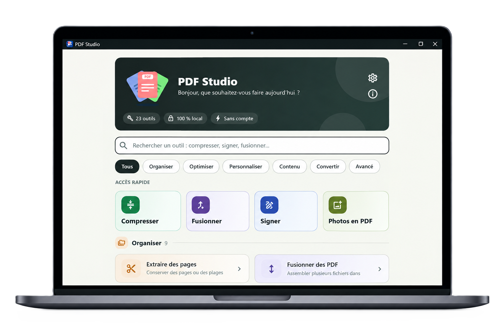
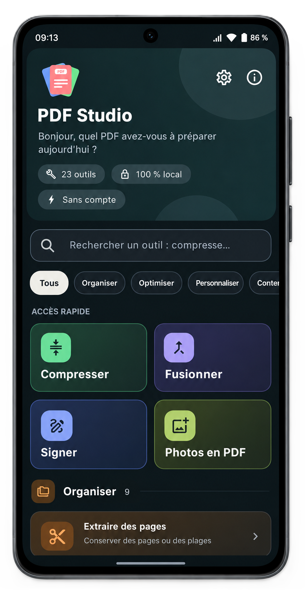

# PDF Studio

[](https://github.com/Fifah727/PDF-Studio/actions/workflows/main.yml)


**Organiser, compresser, signer, numéroter, filigraner et protéger des PDF — entièrement en local.**
Aucun fichier ne quitte votre appareil, aucun compte n'est demandé.

PDF Studio est écrit en **Python + [Flet](https://flet.dev) 1.0** : un seul code pour **Windows** et **Android**,
avec **23 outils** disponibles hors connexion.

<!-- Ajoutez vos captures dans docs/screenshots/ -->
<p align="center">
  
  
</p>

## Télécharger

Les versions compilées sont dans la page des [**Releases**](https://github.com/Fifah727/PDF-Studio/releases/latest) :

| Plateforme | Fichier                                                                                                            | Installation                                                              |
| ---------- | ------------------------------------------------------------------------------------------------------------------ | ------------------------------------------------------------------------- |
| Android    | [`PDF-Studio.apk`](https://github.com/Fifah727/PDF-Studio/releases/latest/download/PDF-Studio.apk)                 | Autorisez l'installation depuis des sources inconnues, puis ouvrez l'APK. |
| Windows    | [`PDF-Studio-Windows.zip`](https://github.com/Fifah727/PDF-Studio/releases/latest/download/PDF-Studio-Windows.zip) | **Extrayez tout le dossier** du ZIP, puis lancez le `.exe`.               |

> **Windows** : l'application n'est pas signée numériquement, donc SmartScreen peut afficher
> « Windows a protégé votre PC ». Cliquez sur **Informations complémentaires**, puis **Exécuter quand même**.
> Le code source est ouvert ci-dessous : vous pouvez aussi compiler l'application vous-même.

## Fonctionnalités

| Groupe            | Outils                                                                                                                                         |
| ----------------- | ---------------------------------------------------------------------------------------------------------------------------------------------- |
| **Organiser**     | Extraire des pages · Fusionner · Supprimer des pages · Diviser (ZIP) · Pivoter · Réorganiser · Insérer des pages · Fusion recto-verso · Rogner |
| **Optimiser**     | Compresser (3 niveaux, ne grossit jamais un fichier) · Métadonnées · Signets                                                                   |
| **Personnaliser** | Filigrane texte · Filigrane image · Signer un PDF · Retirer des filigranes · Numéroter                                                         |
| **Extraire**      | Images (ZIP) · Texte (`.txt`)                                                                                                                  |
| **Convertir**     | Images vers PDF (avec amélioration de scan) · Pages en paysage                                                                                 |
| **Lot**           | Traitement par lot : numéroter, filigraner, compresser, effacer les métadonnées, protéger                                                      |
| **Sécurité**      | Protéger (AES-256) ou déverrouiller un PDF avec mot de passe                                                                                   |

Et aussi : recherche instantanée des outils (insensible aux accents, avec synonymes), thème clair / sombre /
système, historique des derniers fichiers créés, validation en direct des champs, résultat persistant après chaque
opération.

## Confidentialité

- **100 % local** : tous les traitements se font sur votre appareil, sans connexion internet.
- **Sans compte, sans publicité, sans télémétrie.**
- Les préférences et l'historique récent sont stockés dans le dossier de données de l'application
  (`~/.pdf_studio`, ou le stockage privé de l'application sur mobile). Ils sont effaçables depuis l'interface.
- Le journal technique (`logs/pdf_studio.log`) reste sur l'appareil et n'est jamais envoyé.

## Lancer en développement

```bash
git clone https://github.com/Fifah727/PDF-Studio.git
cd PDF-Studio

python -m venv .venv
.venv\Scripts\activate        # Windows  (Linux/macOS : source .venv/bin/activate)
pip install -r requirements-dev.txt

flet run                      # ou : python main.py
pytest                        # suite de tests
```

## Compiler soi-même

`flet build` lit `pyproject.toml` (nom, version, identifiant, dépendances) et `assets/icon.png`.

```bash
flet build windows            # build/windows/ (à lancer sous Windows)
flet build apk                # Android (SDK Android requis)
flet build linux              # à lancer sous Linux
flet build macos              # à lancer sous macOS
```

> Les extensions Flet utilisées par l'application (par exemple `flet-lottie`) doivent être déclarées dans
> `[project].dependencies` de `pyproject.toml` : `flet build` n'embarque que celles-là, pas le contenu de
> `requirements.txt`.

### Compilation automatique (GitHub Actions)

Le workflow [`.github/workflows/main.yml`](.github/workflows/main.yml) se lance à la demande
(**Actions → Build PDF Studio → Run workflow**) : choisissez `android`, `windows` ou `both`, et cochez
« Publier » avec un tag (ex. `v1.3.0`) pour créer une Release contenant l'APK et le ZIP Windows.

## Architecture

```
app/
  domain/          modèles et options, exceptions, ports (PdfRepository, PdfStamper, PdfOptimizer…)
  application/     cas d'usage (organize / optimize / stamp / extract), lot, validation
  infrastructure/  pypdf, Pillow, écriture atomique, JSON (préférences, récents)
  presentation/    Flet : écrans, widgets, routeur, thème clair/sombre
tests/             domaine, cas d'usage, images, interface (sans fenêtre)
```

Principes à conserver :

- `pypdf` et `PIL` ne sont importés que dans `infrastructure/`.
- Un nouvel outil = une méthode sur un port, un cas d'usage, un écran basé sur `screens/tool_kit.py`, un test.
- Toute écriture est **atomique** : pas de PDF tronqué si l'opération échoue.
- Un fichier de sortie ne peut jamais écraser un fichier source.
- Les opérations tournent dans un thread derrière un indicateur de progression.

## Limites connues

- Pas de version **web** : un navigateur n'expose pas les chemins de fichiers locaux.
- **Aucun moteur de rendu PDF** n'est embarqué : pas de miniatures de pages, de conversion PDF → image, d'OCR ni de
  caviardage réel.
- **Retrait de filigranes** : seuls les filigranes, logos et signatures balisés comme tels (posés par PDF Studio ou
  par d'autres logiciels suivant le standard PDF) sont retirés. Un filigrane aplati dans l'image d'une page
  (scan, impression en PDF) n'est pas retirable automatiquement.
- La « signature » insérée est une image : ce n'est pas une signature électronique certifiée.
- Compression : seules les images sont réencodées ; un PDF sans image gagne peu.
- Le texte ajouté (filigrane, numérotation) utilise Helvetica : lettres latines, accents français et malgaches
  compris, mais pas d'alphabet arabe ou cyrillique.
- Les PDF protégés par mot de passe doivent d'abord passer par l'outil « Mot de passe ».

## Contribuer

Les suggestions et corrections sont les bienvenues : ouvrez une
[issue](https://github.com/Fifah727/PDF-Studio/issues) ou une pull request. Merci de lancer `pytest` avant de
proposer un changement.

## Licence

Distribué sous licence **MIT** (voir le fichier [LICENSE](LICENSE)).

## Auteure

**Fifaliana Sarobidy** — développeuse, Madagascar.
[GitHub](https://github.com/Fifah727)
